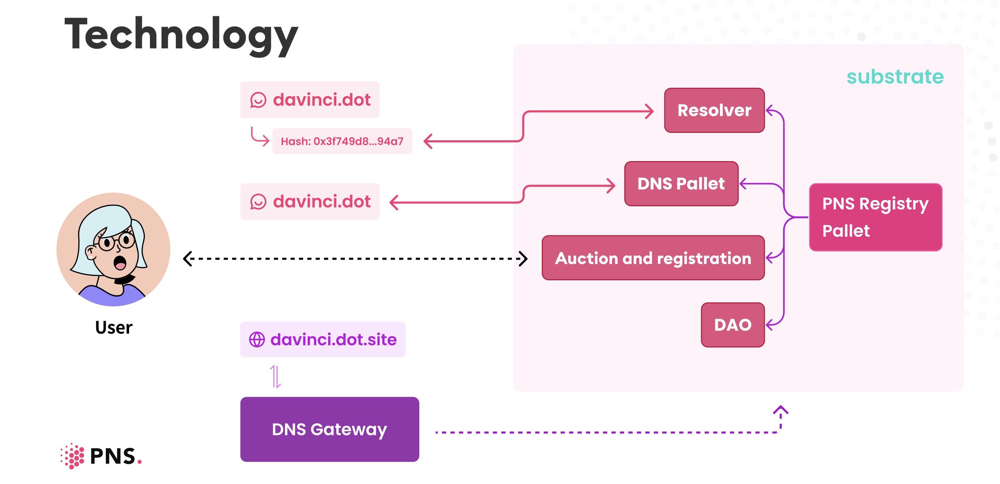
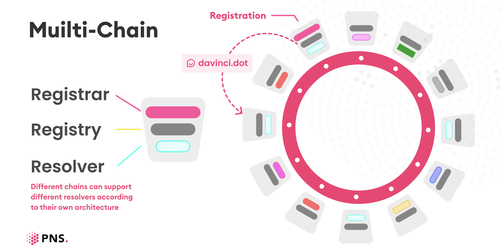

# PNS White Paper EN v1.1

# **About PNS**

- Polkadot Name System (PNS) is a decentralized ecosystem built with Substrate Pallet components through a consensus mechanism and the open-source nature of blockchain. PNS offers domain name services for all parachains within the multi-chain fabric of Polkadot.
- PNS generates a domain name that ends in *.dot* to denote the top of the PNS tree and is able to resolve a variety of on-chain and off-chain data, including wallet addresses, smart contract addresses, IPFS addresses, NFT addresses, traditional DNS addresses, SSL certificates, social accounts, emails, etc. Users have full ownership and management permission over the specific domain.

# **Our Mission**

Offer customers with a decentralized digital identity, an infrastructure based on the Polkadot ecosystem for Web3.0.

# **Our Goals**

- Realize a more secure, transparent, and open domain name system.
- Serve as a digital gateway for personal ID, organizational ID, and digital assets to Web 3.0.
- Interoperate between Web 3.0 and the traditional internet.

# **Product Features**

## **Domain name system**

- Allow users to register a single unique domain name for easy memory and access
- Domain names can be registered, modified, queried, and transacted on the parachains [PNS can be accessed without the need of using a specific token]
- Couple a variety of resolving mechanisms into a single unit of the protocol

[Multi-resolver mechanism supported](https://www.notion.so/537dd304053343e69ef824c246095e37)

- Allow browsers to access directly through the DNS/DNS-over-HTTPS protocol
- A set of and multi-level subdomains can be created to map the domain hierarchy and the dependency relationships between entities
- Parachains can customize the consensus method to cope with different needs and greater extendibility
- PNS is implemented in Substrate's Pallet, and all parachains can be deployed to obtain PNS services
- Each parachains node stores data hash and verifies its identity
- Further realize the decentralization of DNS, allowing each node of Substrate for deployed PNS becomes a DNS server, improving the security, transparency as an open domain name system
- Easy to integrate, the application can be achieved through the SDK integration or to access related services to use PNS. More wallets, browsers, and DApp will be integrated in the future.

## **NFT integration**

- The domain name is unique and indivisible and can be transacted and circulated as the NFT in the marketplace
- By linking the domain name to the NFT address, anyone can access the content on the NFT platform with a corresponding domain name that is easy to memorize and present
- PNS will be integrated with NFT management and trading platform to provide a first-class market for domain name trading

## **Digital Identity**

- Different digital assets can be linked to the PNS domain name, allowing it to become a unique gateway to multi-chain networks.
- Subdomains can be created for members of the company, community, or organization as validate credentials
- Each domain name can be linked to a variety of social networking and communication channels for greater flexibly
- The user has full permission to manage the digital identity while personalized content can be accessed with the unique domain name. By integrating multi-chain data in a single platform, the very own digital identity and gateway to digital assets for Web3.0 is created.

> Addresses with commonality can be grouped in one place, such as *blacklist.dot,* binding all known hackers’ addresses and fraudulent websites into the custom domain for awareness and prevention. In the same way, a collection of subdomains such as whitelist and viplist can also be created as a method of classification for a company or organization.
> 

# **Technical architecture**

- Instead of having independent parachains, PNS itself is an ecosystem built with Substrate Pallet components on parachains, interoperating with multi-chain ecological architecture. It consists of seven parts：

### **Registration**

Registrar:  PNS will select a parachain as the initial allocation of the domain name for the registration, auction, and update, ensuring the uniqueness of the domain name and assigning the domain name effectively.

Registry: The domain name registry on the parachains for ownership record and management

### **Resolver**

- Allow users to bridge multiple specialized chains of wallet, website domain name, social networking account, NFT assets, and other information into one sharded domain name.
- PNS takes full account of the uniqueness of each chain, flexibly mix and match components of a different framework for different solutions.

### **DNS Pallet**

- DNS Pallet is a key contributor to the stability of PNS operation, which allows each Substrate node to adhere to the DNS/DNS- over-HTTPS protocol, that is, all Substrate nodes can be used as nodes of DNS resolver. These nodes fully guarantee the security and stability of PNS as a decentralized domain name system.

### **PNS Gateway**

- The DNS protocol gateway is implemented by the unique server node that allows access to the PNS domain name in the way of DNS, and the domain name mapping to *dot.site,* also supports dns-over-https
- For the PNS domain name that is not bridged to the website, the on-chain status of a domain name will be displayed

### **PNS Manager APP**

- Web APP, the domain management platform serves as the main gateway to PNS

### **PNS SDK**

- JavaScript SDK provides SDK for resolving and operating PNS, supporting the integration of wallets and decentralized applications

### **PNS DAO**

- PNS DAO is a self-rule body for the decentralization of PNS, which aims to formulate, revise, update and manage the development and operation of PNS.

## **Technical Architecture Drawing**

### **Three ways to access PNS services**

- Through the Resolver;
- Through DNS Pallet;
- Through the PNS gateway, PNS will automatically generate a second-level domain name of .*dot.site,* which can be accessed directly through the browser.

### **Fully leverage the features of Pallet: the single validator, multi-chain DNS Pallet Resolver**

## **How to obtain a domain name**

### **The mechanism for domain name assignment**

- PNS domain names will be assigned through retention, auction and public registration.

### **Retention of domain names**

- The domain name of an important website can be retained for three years, and domain holders can verify the domain through their domain name certificate in a private manner, and the retained domain names are as follows:
- All country names (including abbreviations)
- Top 500 city names in the world
- Top 100 projects on CoinMarketCap

### **Domain auction**

- Auction scope: 4-9 letter domain name
- Auction format: Candle auction
- Initiation of the auction: The auction is initiated by the first registered pnsisgood.dot. If it is found that the domain name has not been registered, the auction of the domain name can be initiated.
- Auction duration: maximum 72 hours
- Only supports English, numbers, and underscore

Emoji will be transformed into Unicode, for example, 😊 = 567890 = xn-567890，thus 😊.dot is equivalent to xn-567890.dot, and the domain can be up to 9 letters

### **Public registration**

- Domain names with 10 or more letters are open for public registration on a first-come-first-served basis, no auction involved

## **Pricing**

### **Registration Fee**

Registration fee = registration cost + annual fee + Gas

### **Registration Cost**

- For domain names obtained through the retention and claim mechanism, a registration cost of 2000USD applied
- The registration cost for a 4 to a 9-letter domain name is determined by the auction. The starting price for a 4-5-letter domain name is 200USD, and the starting price for a 6-9-letter domain name is 20USD.
- The registration cost for a domain name with 10 or more letters is fixed at 20USD

50% of the registration cost will be deposited to PNS DAO for equivalent voting right. When the user releases a domain name, the deposit will be returned and the corresponding voting right will be waived.

**The Purpose of Deposits:**

- Motivate users to release valuable domain names
- Save our cost from repeatedly registering the domain name
- Better exercise the rights of PNS DAO as the governor

**The Features of DAO**

- Deciding on protocol upgrade
- Responsible for pricing and parameter adjustment
- Responsible for delisting bad actor
- Allocating funds for community projects

### Annual Fee

- Short domain name with 4-5-letter: 50 USD/ per year
- Domain names with more than 6 letters: 5 USD/ per year

### **Gas**

The Gas fee is determined according to the registration status of the blockchain in which the operating PNS registration module is located.

## **Subdomain extensions**

- Since each subdomain name occupies the storage space of the entire chain, just like the space junk around the earth, to ensure that the storage space of each parachain is not occupied by invalid spam, each domain name will come with 20 free subdomains, users may decide if more subdomains needed in the future.
- Regarding the relationship between the domain name and the subdomain name, the domain name has full permission in management while the subdomain has the exclusive right-of-use. For example, the management right of *sales.pns.dot*, is in *pns.dot*, and the right of ownership is in salesman1; *pns.dot* can transform the right-of-use from salesman1 to salesman2 at any time.

## **Others**

- All payments can be made by DOT. Each parachains can be exchanged with DOT through a smart contract, and the payment can be made in its official currency（providing an application scenario for multi-currency）.
- Domain name registration is priced in US dollars, and the ratio of US dollars, DOT and parachains native tokens are set through an automated price prediction model. When the update takes up to 6 hours, the average price of a token in the last 24 hours is used.
- When registering a domain name, users can fill in the referral details and the referred party will receive 5% of the registration fee.

## Registration notes

- Domains have a minimum registration period of 1 year, and the maximum period is 100 years.
- If the domain name is not renewed by the expiration date, the name will enter a renewal grace period of 90 days, user can renew it within such period.
- During the renewal grace period, the domain name cannot be modified, and the data read is not considered to be valid.
- After the domain name expires, it cannot be re-registered within one year.

# **Application Scenarios**

- PNS helps realize the vision of Web 3.0 through connecting Web 2.0 and Web 3.0 with memorable domain names, helping users to create unique digital identities, and promoting the popularity and circulation of NFT.

## **DNS Security**

- Bridging the domain name to a website, allowing direct access to the website through a unique domain name, providing secure and stable access.
- DApps can also use the PNS domain name as a gateway to bind the contract address, and the contract can be updated by changing the bound contract address.

## **Multi-chain wallets management**

- Users on the chain are usually involved in the multi-chain ecosystem with multiple wallet addresses. The domain name can be bound to different wallet addresses, unifying different addresses with a unified domain name for easy memorization and extra convenience.

## **NFT integration**

- NFT can be directly linked to a domain name, allowing others to access the content on the NFT platform with a corresponding domain name Users can initiate a transaction directly to a certain domain name. For NFT collectors, the collection of NFT can be realized by setting a subdomain name, which makes it easy to display and manage their NFT collections.

## **Digital identity for Individual**

- Due to the uniqueness of the domain name, making it an exclusive digital identity for an individual, facilitating service providers to depict portraits and provide better services to users.
- **Personal ID for Web 3.0**

## **Digital identity for Organisation**

- The identity of an organization is represented by the domain name, a set of and multi-level subdomains can be created to map the domain hierarchy and the dependency relationships between entities

## **SSO login and signature**

- Through PNS unified verification, domain name holders can log in to different DApp; holders of organizational subdomain can sign on behalf of the organization he/she belongs to.

## **Domain Investment**

- As a scarce resource of the “Internet”, the domain name has room for appreciation and can make a profit by investing in the domain name.

# **Roadmap**

- 2021.10- The official launch of PNS, domain with 10-letter or more are opened for public registration
- 2021.11-PNS releases NFT-related features
- 2021.12-PNS releases candle auction feature

# **Other links**

- Official site: https://app.pns.link
- Official WeChat account: PNS Official
- Github: https://github.com/pnsproject
- Twitter: https://twitter.com/PolkaNameSystem
- Discord: [https://discord.gg/WfYwxNW5Jn](https://discord.gg/WfYwxNW5Jn)
- Medium: [https://medium.com/@pns.dot](https://medium.com/@pns.dot)
- Telegram: https://t.me/joinchat/4qDijpz-zmZhODEx